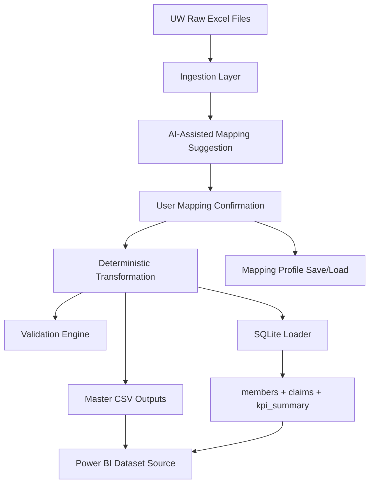

# Health Insurance Claims Automation Pipeline

End-to-end backend and UI solution for ingesting multi-underwriter claims files, standardizing to a master schema, validating outputs, loading a SQLite analytics database, and running via CLI, Streamlit UI, or Docker.

## Assignment Alignment

Implemented:
- Phase 1-8 backend and platform foundation
- Ingestion for UW1/UW2/UW3 with source-specific parsing rules
- Deterministic transformation into `master_census.csv` and `master_claims.csv`
- Validation report generation (`validation_report.json`)
- SQLite load (`claims_analytics.db`) with KPI summary table
- Streamlit upload + mapping confirmation UI
- AI-assisted mapping suggestions with confidence tiers
- Mapping profile save/load and schema compatibility scoring
- Dockerized runtime (UI + optional batch pipeline service)
- Power BI execution pack: pre-aggregated reporting tables + theme + page build guide
- Automated multi-page PDF report generation using seaborn/matplotlib
- Optional Azure OpenAI narrative generation for report text sections

Pending for final assignment packaging:
- Power BI `.pbix` file creation in Power BI Desktop (manual authoring step)

## Architecture



## Project Structure

```text
src/
  main.py
  claims_pipeline/
    config.py
    ingestion.py
    transform.py
    validation.py
    database.py
    mapping.py
    mapping_profiles.py
    pipeline.py
  ui/
    app.py
tests/
data/
  processed/
outputs/
configs/
  mappings/
Dockerfile
docker-compose.yml
```

## Local Run (CLI)

Install dependencies:

```bash
python -m pip install -r requirements.txt
```

Run pipeline:

```bash
python src/main.py
```

Run modes:

```bash
# full (default): PDF + Power BI CSV exports
python src/main.py --run-mode full

# PDF only: generate report without writing Power BI CSV exports
python src/main.py --run-mode pdf_only

# Power BI handoff: PDF + CSV + PBIX build package/instructions
python src/main.py --run-mode powerbi_handoff --pbix-file-name claims_dashboard.pbix
```

Expected outputs:
- `data/processed/master_census.csv`
- `data/processed/master_claims.csv`
- `outputs/validation_report.json`
- `outputs/claims_analytics.db`
- `outputs/Claims_Analysis_Report.pdf`
- `powerbi/data/*.csv` (dashboard-ready summary tables)

## Streamlit UI Run

```bash
python -m streamlit run src/ui/app.py --server.port 8501
```

Open:
- `http://localhost:8501`

UI workflow:
1. Upload one or more UW files.
2. Review AI mapping suggestions and confidence levels.
3. Optionally load/save mapping profiles under `configs/mappings`.
4. Choose pipeline mode:
   - Full (PDF + Power BI CSV)
   - PDF Only
   - Power BI Handoff
5. Confirm low-confidence mappings.
6. Run pipeline and inspect generated artifact paths.

## Docker Run

Start UI service:

```bash
docker compose up -d streamlit
```

Run backend batch service:

```bash
docker compose --profile batch run --rm pipeline
```

Stop services:

```bash
docker compose down
```

## Testing

Run test suite:

```bash
python -m pytest -q
```

Current status: all implemented phase tests pass.

## Power BI Build Assets

- Theme file: `powerbi/theme_assignment.json`
- Page-by-page guide: `powerbi/PHASE10_PBI_BUILD_GUIDE.md`
- DAX pack: `powerbi/DAX_MEASURES.md`
- Final QA checklist: `powerbi/PAGE_LAYOUT_CHECKLIST.md`
- Prebuilt Power BI data tables: `powerbi/data/*.csv` (generated by pipeline)
- Auto-generated PBIX handoff package (in handoff mode): `outputs/powerbi_handoff/`

## Optional LLM Narrative (Azure OpenAI)

Set these environment variables to enable model-generated report text:
- `AZURE_OPENAI_API_KEY`
- `AZURE_OPENAI_ENDPOINT`
- `AZURE_OPENAI_DEPLOYMENT`
- `AZURE_OPENAI_API_VERSION`

If not configured, the report uses deterministic fallback narrative text.

## Data and Transformation Rules

High-level normalization highlights:
- UW1: skip merged header row; Fils to USD conversion.
- UW2: parse integer dates (`YYYYMMDD`); direct USD values.
- UW3: skip metadata rows; Excel serial DOB parsing; QAR to USD conversion.
- Illness and benefit categories standardized across sources.
- Derived fields: `age_group`, `month`, `quarter`, `year`, and risk flags.

## Template Registry (Generalized Inputs)

Template specs are now loaded from `configs/templates/*.json` instead of being hard-coded.

To onboard a new incoming template:
1. Add a new JSON spec in `configs/templates/` (same shape as `UW1.json`, `UW2.json`, `UW3.json`).
2. Include sheet names, skip rows, and expected columns.
3. Reopen Streamlit UI: the new template appears in auto-detection and assignment options.

## Why This Design Is Reviewer-Friendly

- Deterministic core transformations and validations for auditability.
- AI assistance is limited to mapping suggestions, followed by user confirmation.
- Reusable mapping profiles reduce repeat manual work for new insurer formats.
- Docker support enables one-command runtime setup.
- Comprehensive tests protect ingestion, transformation, validation, DB load, mapping logic, and container contract.

## Submission Notes

Use this repository as the backend + orchestration foundation. Complete the Power BI dashboard pages and final report export as the final assignment layer on top of the generated CSV/SQLite outputs.
