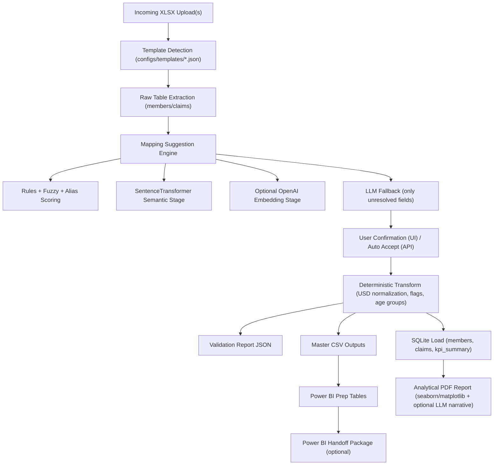

# Health Insurance Claims Automation Pipeline

Production-style assignment solution for ingesting variable underwriter Excel files, confirming column mappings, generating standardized outputs, loading analytics tables, and producing report artifacts.

## What It Does (Current Behavior)

- Accepts one or more incoming UW Excel files (`.xlsx`) through:
  - Streamlit UI
  - FastAPI upload endpoint
  - CLI batch run
- Auto-detects which template each file matches using `configs/templates/*.json`.
- Suggests column mappings using staged AI logic:
  - rules + fuzzy scores
  - SentenceTransformer semantic similarity
  - optional OpenAI embeddings
  - LLM fallback when unresolved
- Requires user confirmation in UI before pipeline execution.
- Runs deterministic transformation and validation pipeline.
- Generates:
  - `master_census.csv`
  - `master_claims.csv`
  - `validation_report.json`
  - `claims_analytics.db`
  - `Claims_Analysis_Report.pdf`
  - Power BI handoff assets (CSV + guide/theme/checklists)
- Supports run modes:
  - `full`
  - `pdf_only`
  - `powerbi_handoff`

## Architecture



## End-to-End Usage

## 1) Prerequisites

- Python `3.9+` (recommended `3.12`)
- Docker Desktop (for containerized run)

## 2) Clone and Setup

```bash
git clone https://github.com/alokgupta1996/claim_processing.git
cd claim_processing
python -m venv .venv
.venv\Scripts\activate
python -m pip install -r requirements.txt
```

Optional env file:

```bash
copy .env.example .env
```

Configure `.env` if using Azure/OpenAI narrative or embedding stages:
- `AZURE_OPENAI_API_KEY`
- `AZURE_OPENAI_ENDPOINT`
- `AZURE_OPENAI_DEPLOYMENT`
- `AZURE_OPENAI_API_VERSION`
- `OPENAI_API_KEY` (optional for embedding stage)

## 3) Run with Streamlit UI (Recommended)

```bash
python -m streamlit run src/ui/app.py --server.port 8501
```

Open: `http://localhost:8501`

UI flow:
1. Upload one or more UW files.
2. Check template detection + assignment.
3. (Optional) Load mapping profile.
4. Review/adjust mapping suggestions.
5. Select run mode (`full` / `pdf_only` / `powerbi_handoff`).
6. Run pipeline.
7. Download report outputs from UI buttons.

## 4) Run with API (Programmatic)

Start API:

```bash
python -m uvicorn api.app:app --host 0.0.0.0 --port 8502
```

Docs:
- `http://localhost:8502/docs`

Health:

```bash
curl http://localhost:8502/api/health
```

Upload and run:

```bash
curl -X POST "http://localhost:8502/api/upload-and-run" ^
  -F "files=@UW1_OmanInsurance_RawData.xlsx" ^
  -F "files=@UW2_NationalLife_RawData.xlsx" ^
  -F "run_mode=pdf_only" ^
  -F "ai_engine=sentence_transformer"
```

## 5) Run with CLI

```bash
python src/main.py --run-mode full
python src/main.py --run-mode pdf_only
python src/main.py --run-mode powerbi_handoff --pbix-file-name claims_dashboard.pbix
```

## 6) Run with Docker

Build and start UI + API:

```bash
docker compose up -d --build streamlit api
```

Run batch pipeline:

```bash
docker compose --profile batch run --rm pipeline
```

Stop:

```bash
docker compose down
```

Ports:
- Streamlit: `8501`
- API: `8502`

## Outputs

Primary outputs are created under:
- `data/processed/` (or run-specific subfolder)
- `outputs/` (or run-specific subfolder)
- `powerbi/data/` (in `full` / `powerbi_handoff`)

Common files:
- `master_census.csv`
- `master_claims.csv`
- `validation_report.json`
- `claims_analytics.db`
- `Claims_Analysis_Report.pdf`
- `usage_metrics.json`

If `powerbi_handoff` mode is selected:
- PBIX build handoff folder under `outputs/.../powerbi_handoff/`

## Template Generalization

Templates are not hardcoded to only UW1/UW2/UW3.

Add new template support by creating a JSON spec in:
- `configs/templates/`

Each spec defines:
- workbook filename pattern/reference
- sheet names
- skip rows
- expected members/claims column sets

The detector and mapping UI/API automatically include new templates on restart.

## Power BI Notes

This repo prepares all Power BI inputs and handoff artifacts.
Actual `.pbix` authoring remains a Power BI Desktop manual step.

Included assets:
- `powerbi/theme_assignment.json`
- `powerbi/PHASE10_PBI_BUILD_GUIDE.md`
- `powerbi/DAX_MEASURES.md`
- `powerbi/PAGE_LAYOUT_CHECKLIST.md`

## Tests

```bash
python -m pytest -q
```

Covers ingestion, transform, validation, DB, mapping, template detection/registry, API upload flow, docker contract, and docs/assets checks.
